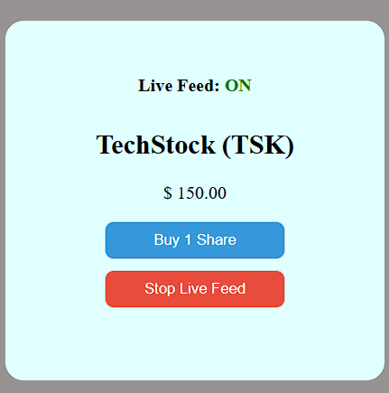

# 📈 Pro-Trader Dashboard

A high-performance stock market simulator focusing on asynchronous user experiences. This project explores real-time data flow, optimistic UI patterns, and efficient resource management.

## 🚀 Live Demo
You can try the live application here: 
👉 **[View live project](https://ramitshapkota.github.io/JS-Learning-Journey/Mini%20Project/Pro-Trader-Dashboard/index.html)**

---

## ✨ Features
* **Live Market Feed:** Simulates dynamic price fluctuations using optimized `setInterval` loops.
* **Optimistic "Undo" Pattern:** Implements a 5-second grace period for purchases, allowing users to cancel trades before they are finalized.
* **Transactional History:** Automatically appends confirmed purchases to a portfolio list.
* **Resource Optimization:** Includes a global "Kill Switch" to stop background processes and save CPU/Battery.

## 🛠️ Tech Stack
* **Frontend:** HTML5, CSS3 (Advanced Selectors & Transitions)
* **Logic:** Vanilla JavaScript (ES6+)
* **State Management:** Asynchronous Event Handlers & Timer IDs

## 📖 What I Learned
This project was a deep dive into the **JavaScript Event Loop** and user-centric design:
1. **Asynchronous Lifecycle:** Managing complex interactions between `setTimeout` and `setInterval`.
2. **Timer Management:** Using `clearTimeout` and `clearInterval` to prevent memory leaks and "ghost" processes.
3. **Optimistic UI:** Learning how to provide immediate visual feedback while delaying the actual data commitment.
4. **Data Integrity:** Using `parseFloat` and template literals to ensure numeric precision.

## ⚙️ Installation & Usage
To run this project locally:
1. Clone the repository: `git clone https://github.com/RamitShapkota/JS-Learning-Journey.git`
2. Navigate to: `Mini Project/Pro-Trader-Dashboard`
3. Open `index.html` in your browser.

---
*Created with ❤️ by [RamitShapkota]*